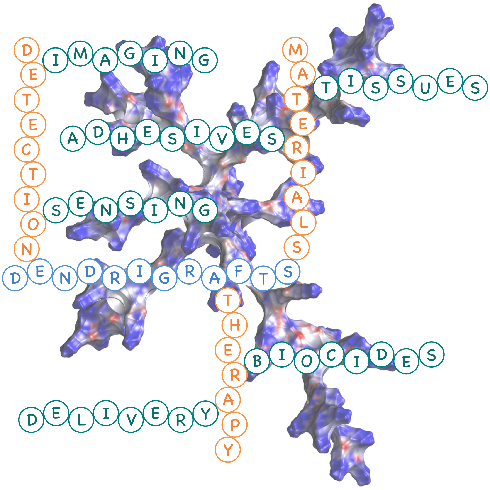
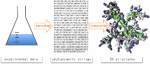
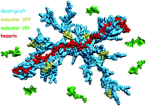

# About me

After obtaining a Master degree in chemistry, I moved to Montpellier (France)
to become a PhD student. Under the supervision of Dr Laurent Vial, I studied
the fascinating field of supramolecular chemistry, applied to biosensing. I
was awarded a PhD in 2016.

In 2017, I moved to Glasgow to join the group of
<a href="http://www.chem.gla.ac.uk/cronin">Prof. Lee Cronin</a> as a
PostDoc. I'm now a part of the "reactionware" team, which aims to digitize
organic chemistry through, for example, 3D printed reactors. In my day to day
work, I research new techniques to improve the capabilities of these reactors.

# Recent Publications

- Digitization of multi-step organic synthesis in reactionware for on
demand pharmaceuticals  
P. J. Kitson, G. Marie, J.-P. Francoia, S. S. Zalesskiy, R. C. Sigerson,
J. S. Mathieson and L. Cronin *Science*, 2017, *accepted*

- [Everything you always wanted to know about poly-*L*-lysine dendrigrafts (but were afraid to ask)](http://onlinelibrary.wiley.com/wol1/doi/10.1002/chem.201704147/abstract)  
J.-P. Francoia and L. Vial, *Chem. Eur. J.*, 2017, **DOI:**
10.1002/chem.201704147

  

- [Digitizing Poly-*L*-Lysine Dendrigrafts: from Experimental Data to Molecular Dynamics Simulations](http://pubs.acs.org/doi/pdf/10.1021/acs.jcim.7b00258)  
J.-P. Francoia, J.-C Rossi, G. Monard and L. Vial, *J. Chem. Inf. Model.*,
2017, **57**, 2173 - citation: 1  

  

- [Chirality Sensing and Discrimination of Lysine Derivatives in Physiological Conditions with a Dyn\[4\]arene](http://pubs.rsc.org/en/content/articlelanding/2016/cc/c6cc07713g)
L. Vial, M. Dumartin, M. Donnier-Maréchal, F. Perret, J.-P. Francoia,
J. Leclaire, *Chem. Commun.*, 2016, **52**, 14219

  

- [ChemBrows: An Open-Source Application Software To Keep Up to Date with the Current Literature](http://pubs.acs.org/doi/abs/10.1021/acs.jchemed.6b00024)  
J.-P. Francoia and L. Vial, *J. Chem. Educ*, 2016, **93**, 1137 - open access, citation: 1  

  

- [A KISS (Keep It Simple, Sensor) Array for Glycosaminoglycans](http://pubs.rsc.org/en/content/articlelanding/2014/cc/c5cc07628e\#!divAbstract)  
J.-P. Francoia and L. Vial, *Chem. Commun.*, 2015, **51**, 17544 - citations: 3  

  

- [Monitoring Clinical Levels of Heparin in Human Blood Samples with an Indicator-Displacement Assay](http://pubs.rsc.org/en/Content/ArticleLanding/2015/CC/c4cc08563a\#!divAbstract)  
J.-P. Francoia, R. Pascal, and L. Vial, *Chem. Commun.*, 2015, **51**,
1953 - citations: 11  

  

- [A Double Conformationally Restricted Dynamic Supramolecular System for the Substrate-Selective Epoxidation of Olefins—A Comparative Study on the Influence of Preorganization](http://onlinelibrary.wiley.com/doi/10.1002/cctc.201402726/full)  
E. Lindbäck, S. Cherraben, J.-P. Francoïa, E. Sheibani, B. Lukowski,
A. Proñ, H. Norouzi-Arasi, K. Månsson, P. Bujalowski, A. Cederbalk,
T. H. Pham, T. Wixe, S. Dawaigher and K. Wärnmark, *ChemCatChem*, 2015,
**7**, 333 - citation: 1  

- [Multi-Technique Characterization of Poly-L-lysine Dendrigrafts–Cu(II) Complexes for Biocatalysis](http://onlinelibrary.wiley.com/doi/10.1002/mabi.201400341/abstract)
J.-C. Rossi, B. Maret, K. Vidot, J.-P. Francoia, M. Cangiotti, S. Lucchi,
C. Coppola, and M. F. Ottaviani, *Macromol. Biosci.*, 2015, **15**, 275 - citations: 4  

  

# Conferences

Slides and posters available [here](https://github.com/JPFrancoia/PostersSlides)

- **JMJC 2016 (Journées Méditerranéennes des Jeunes Chercheurs)**, *Nice*, France  
Poster presentation

- **MSMLG 2016 (Molecular Sensors and Molecular Logic Gates)**, *Bath*, United Kingdom  
Oral presentation and poster presentation

- **JMJC 2015 (Journées Méditerranéennes des Jeunes Chercheurs)**, *Montpellier*, France  
Oral presentation

- **MeMoSim 2015 (Modeling Methods and multiscale Simulations)**, *Lyon*, France  
Poster presentation

- **Balard Chemistry Conferences 2014**, *La Grande Motte*, France  
Poster presentation

- **JJC 2014 (Journées des Jeunes Chercheurs)**, *Montpellier*, France  
Poster presentation
