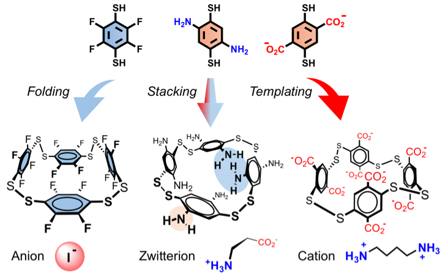

# About me

My name is Laurent Vial. I am a CNRS research scientist (University of Lyon, France), currently working on artificial receptors for biologically relevant molecules with applications as biosensors or therapeutics.

# Recent Publications

- [Everything you always wanted to know about poly-*L*-lysine dendrigrafts (but were afraid to ask)](http://onlinelibrary.wiley.com/wol1/doi/10.1002/chem.201704147/abstract)  
J.-P. Francoia and L. Vial, *Chem. Eur. J.*, 2017, **DOI:**
10.1002/chem.201704147

  

- [Digitizing Poly-*L*-Lysine Dendrigrafts: from Experimental Data to Molecular Dynamics Simulations](http://pubs.acs.org/doi/pdf/10.1021/acs.jcim.7b00258)  
J.-P. Francoia, J.-C Rossi, G. Monard and L. Vial, *J. Chem. Inf. Model.*,
2017, **57**, 2173 - citation: 1  

  

- [Chirality Sensing and Discrimination of Lysine Derivatives in Physiological Conditions with a Dyn\[4\]arene](http://pubs.rsc.org/en/content/articlelanding/2016/cc/c6cc07713g)
L. Vial, M. Dumartin, M. Donnier-Maréchal, F. Perret, J.-P. Francoia,
J. Leclaire, *Chem. Commun.*, 2016, **52**, 14219

  

- [On-demand Cyclophanes: Substituent-directed Self-assembling, Folding and Binding](http://pubs.acs.org/doi/abs/10.1021/acs.joc.5b02605)
P.-T. Skowron, M. Dumartin, E. Jeamet, F. Perret, C. Gourlaouen, A. Baudouin, B. Fenet, J.-V. Naubron, F. Fotiadu, L. Vial and J. Leclaire, *J. Org. Chem.*, 2016, **81**, 654

  

- [ChemBrows: An Open-Source Application Software To Keep Up to Date with the Current Literature](http://pubs.acs.org/doi/abs/10.1021/acs.jchemed.6b00024)  
J.-P. Francoia and L. Vial, *J. Chem. Educ*, 2016, **93**, 1137 - open access, citation: 1  

  

- [A KISS (Keep It Simple, Sensor) Array for Glycosaminoglycans](http://pubs.rsc.org/en/content/articlelanding/2014/cc/c5cc07628e\#!divAbstract)  
J.-P. Francoia and L. Vial, *Chem. Commun.*, 2015, **51**, 17544 - citations: 3  

  

- [Monitoring Clinical Levels of Heparin in Human Blood Samples with an Indicator-Displacement Assay](http://pubs.rsc.org/en/Content/ArticleLanding/2015/CC/c4cc08563a\#!divAbstract)  
J.-P. Francoia, R. Pascal, and L. Vial, *Chem. Commun.*, 2015, **51**,
1953 - citations: 11  

  

